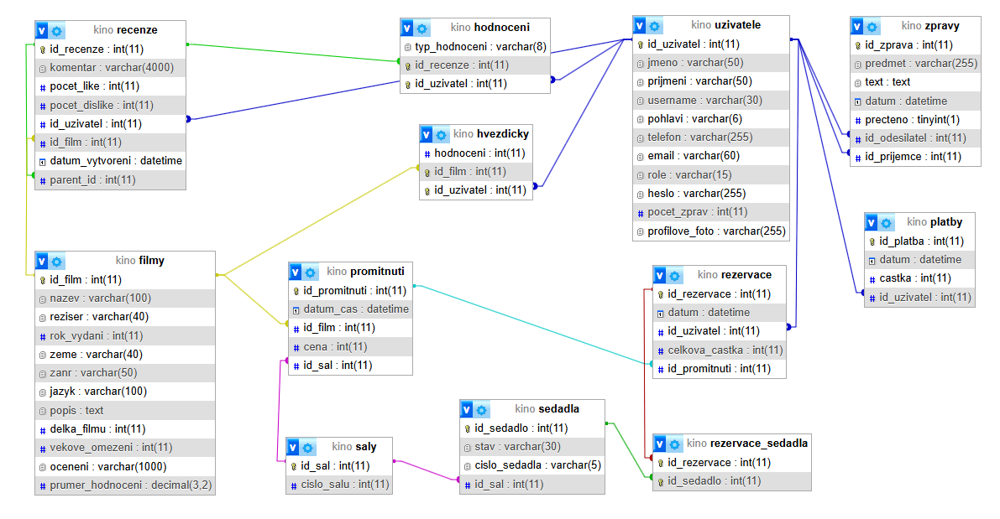

# GRAPHITE
## Kino z černobílé doby
Toto je manuál pro webové stránky kina Graphite. Je zaměřen primárně pro vývojáře, který na ní v budoucnu pracuje.

### Obsah
1. Spuštění projektu ve vývojářském prostředí
2. Orientace ve frontendu
3. Orientace v backendu
4. Databáze
5. Obecné schopnosti stránky

### 1. Spuštění projektu ve vývojářském prostředí

Je třeba mít připravené následující nástroje:

- Běžný webový prohlížeč - např: **Chrome** nebo **Edge**
- **Node.js**
- **XAMPP** minálně s **Apache** serverem a **MySQL** databází
- Povolit balíčky **gd** a **openssl** v .ini souboru pro PHP (v <u>xampp/php/</u>)
- Doporučeno používat **Visual Studio Code** jako editor
- Je také doporučeno být na platformě **Windows 11**, ovšem

Také třeba mít zdroj:

- Hlavní projekt obsahující frontend i backend
- Skripty k vytvoření MySQL databáze + její naplnění
- klíč k šifrování v *.env* souboru

Pro samotné zprovoznění je třeba:

- Přejít do složky <u>Design/</u> a na tom místě spustit `npm --install` v terminálu
- **Otevřít XAMPP** (nejlépe jako správce) a spustit **Apache** a **MySQL**
- Pro jednoduchost se hodí najít v XAMPP složkách složku <u>php/</u> a přidat ji do systémové proměnné **Path**
- Otevřít druhou instanci terminálu a přejít do složky <u>Design/backend/</u> a spustit `php -S 127.0.0.1:8000`
- Zadat do prohlížeče <u>http://localhost/phpmyadmin/</u>, přejít do záložky **SQL** a spustit tam SQL skript na vytvoření databáze **kino**
- Po vytvoření databáze **kino** do ní přejít a v záložce **SQL** nad touto databází spustit skript s daty
- Soubor s šifrovacím klíčem **.env** je nutno vložit so složky <u>Design/backend/config/</u>
- Nyní stačí už jen přejít do první instance terminálu (stále ve složce <u>Design/</u>) a spustit `npm run dev`
- Pokud se sama neotevře záložka prohlížeče tak je třeba dostat se na adresu z výstupu terminálu (běžně něco jako: <u>http://localhost:3000/</u>)

Tímto by mělo být vše funkční.

### 2. Orientace ve frontendu

##### Po technologické stránce

Frontend projektu je napsán pomocí framweworku **React** a to nad jazykem **Typescript**. Pro stylování byl použit framework **Tailwind**. Projekt se setavuje pomocí **Vite**. Pro přepínání mezi jednotlivými stránkami je použit **BrowserRouter** v souboru **App.tsx**. 

##### Po stránce umístění a souborů

Prakticky vše důležité je ve složce <u>Design/src/</u>. V podsložce <u>types/</u> se nachází soubor definující potřebné datové třídy, obvláště užitečné pro přebírání dat z databáze. Ve složce <u>styles/</u> se nachází globální stylový soubor pro věci, které nebyly vyřešeny pomocí tailwindu. Složka <u>pages/</u> si zaslouží velikou pozornost, jelikož obsahuje samotné stránky jako react komponenty. mezi těmito stránkami se Router přepíná. Hooks slouží pro vlastní React hooky, například pro hlídání uživatele. Složka <u>api/</u> je dalším pilířem frontendu, jelikož jsou zde volání backendu a řešení session na frontendové straně. Složka <u>components/</u> slouží jako místo pro zbylé komponenty Reactu použité v projektu. Tam se dají najít mimo jiné i modální okna pro přihlášení či prohlížení uživatele.

##### Po stránce stylu

Vzhled stránky se více či méně drží stylu Art Deco. Hlavní barvou se stává #912D3C - to je něco mezi středně tmavou červenou a růžovou. Jako sekundární barva, taková kterou se vyplní negativní prostor, byla vybrána téměř úplně bílá ( #f9f9f9). Tyto barvy jsou podpořeny ještě barvami zvýraznění černou a v extrémním případě (například odhlášení) i barvou ostře červenou #DC2626. Jako font je převážně použit Osvald. Zde obrázek:

### 3. Orientace v backendu

Backend spoléhá na php. Složka <u>api/</u> obsahuje hlavní soubory, které vykonávají akce databáze jako například přihlášení, či získání dat o uživateli či zprávy. Ve složce <u>config/</u> je soubor co řeší hlavní připojení k databázi. Také se do ní má vkládat soubor *.env* s klíčem šifrování. Za zmínku stojí už jen složka <u>utils/</u>, kde jsou užitečné funkce jako například helper pro šiforvání.

Obsah zpráv je šifrován. Taktéž je šifrováno telefonní číslo uživatel v databázi. To vše podle **aes-256-gcm** standardu. Heslo je hashované.

### 4. Databáze

Databáze je řešena pomocí **SQL** a to konrétně **MySQL**. Místo spousty slov možná bude lepší pohled na následující obrázek (případně lze najít vedle tohoto souboru):

### 5. Obecné schopnosti stránky

Toto je pouze obecný popis toho co se dá od stránky čekat navenek. Není zde zmíněno například šifrování správ a osobních údajů nebo jiné vnitřní mechanismy.

- Všechny stránky jsou respozivní.

- Na všech stránkách je nejníže dostupný footer s kontaktními infomacemi a otevíracíma hodinama.

- Hlavní stránka je první co se uživateli ukáže a nabízí přihlášení, přechod na rezervaci lístků (s přihlášením i bez), prohlížení momentálně promítaných filmů s možností přejít na detaily vybraného filmu a nakonec také jeden vybraný film.

- Je možné se z okna přihlášení dostat i na stránku s registrací a zase zpět.

- Po přihlášení se místo okna přihlášení ukáže okno profilu s možností si prohlédnout a upravit své údaje, být upozorněn a prohlížet příchozí zprávy, prohlédnout si odeslané zprávy a také jinému uživateli zprávu poslat.

- Na stránce úpravy údajů se dají upravovat uživatelské údaje jako profilová fotografie, jméno, příjmení, email, pohlaví a telefon.

- V případě Admina je možno na stránce úpravy údajů měnit údaje i jiným uživatelům a to včetně jejich role.

- Lze si rezervovat vstupenky na film a po rezervaci si lze vytisknout lístek.

- Lze si prohlédnout detaily filmu.

- Na film se dá vytvořit recenze hodnotící film slovy i hvězdičkami. Na tuto recenzi se dá dále odpovědět či jí dát like nebo dislike.

